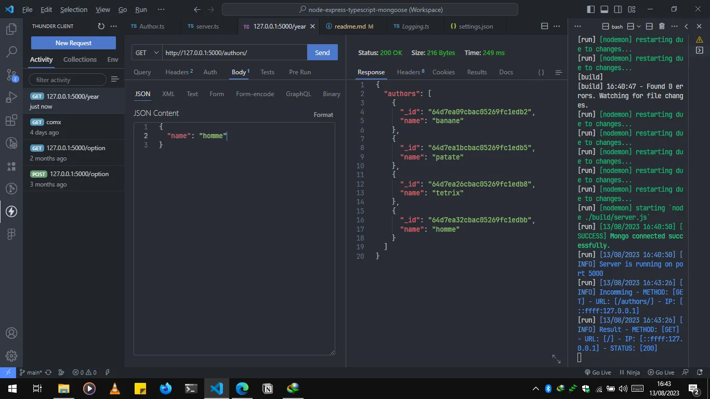

# Base de code Node Express TypeScript Mongoose

Ce référentiel sert de point de départ pour le développement d'une application Node.js avec Express, TypeScript et Mongoose.

## Fonctionnalités

-   Configuration d'un serveur Express.js avec prise en charge de TypeScript
-   Intégration de Mongoose pour la base de données MongoDB
-   Structure de projet de base et organisation
-   Exemples de routes et de modèles à titre de référence
-   Configuration de nodemon pour redémarrer automatiquement le serveur en cas de modification du code
-   Configuration ESLint et Prettier pour une cohérence du code

## Prérequis

Avant de commencer, assurez-vous d'avoir les éléments suivants installés sur votre machine :

-   Node.js (v12 ou supérieur)
-   MongoDB (en cours d'exécution localement ou accessible via une connexion distante)

## Démarrage

1. Clonez le référentiel :

    ```
    git clone https://github.com/votre-nom-utilisateur/init-node-express-typescript-mongoose-code-base.git
    ```

2. Installez les dépendances :

    ```
    cd init-node-express-typescript-mongoose-code-base
    npm install
    ```

3. Démarrez le serveur de développement :

    `yarn dev` ou `npm run dev`

Vous êtes prêt ! l'application tourne sur `http://localhost:5000`.



## Structure du projet

La structure du projet suit une approche modulaire et maintient la base de code organisée. Voici un aperçu des répertoires principaux :

-   `src` : Contient le code source de l'application.
    -   `controllers` : Contient les gestionnaires de routes (controllers) pour les différents endpoints.
    -   `models` : Définit les modèles Mongoose pour interagir avec la base de données.
    -   `routes` : Contient les définitions de routes pour les différents endpoints.
    -   `middlewares` : Contient des fonctions middleware personnalisées.
    -   `library` : Contient des fonctions ou modules utilitaires.
-   `build` : Contient le code JavaScript transpilé (généré après la compilation du code TypeScript).

## Contribution

Les contributions sont les bienvenues ! Si vous trouvez des problèmes ou souhaitez améliorer la base de code, n'hésitez pas à soumettre une pull request.

## Licence

Ce projet est sous licence [MIT](LICENSE).
